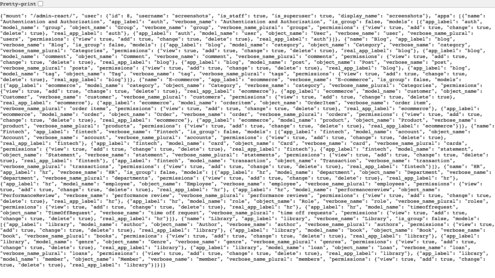
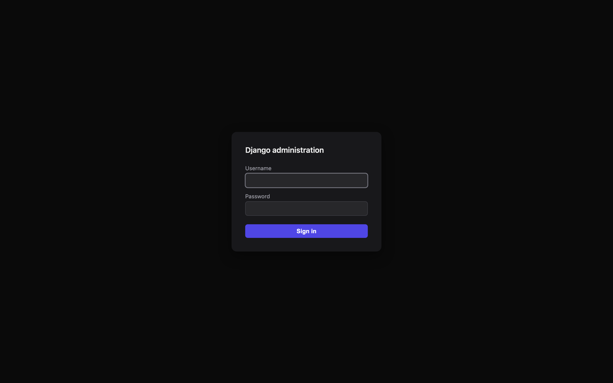
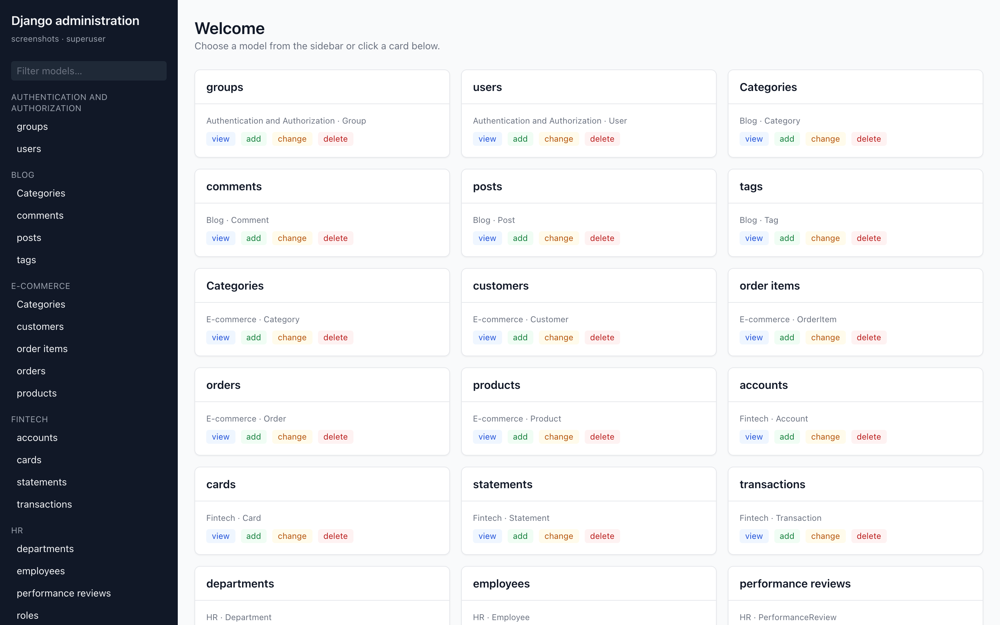
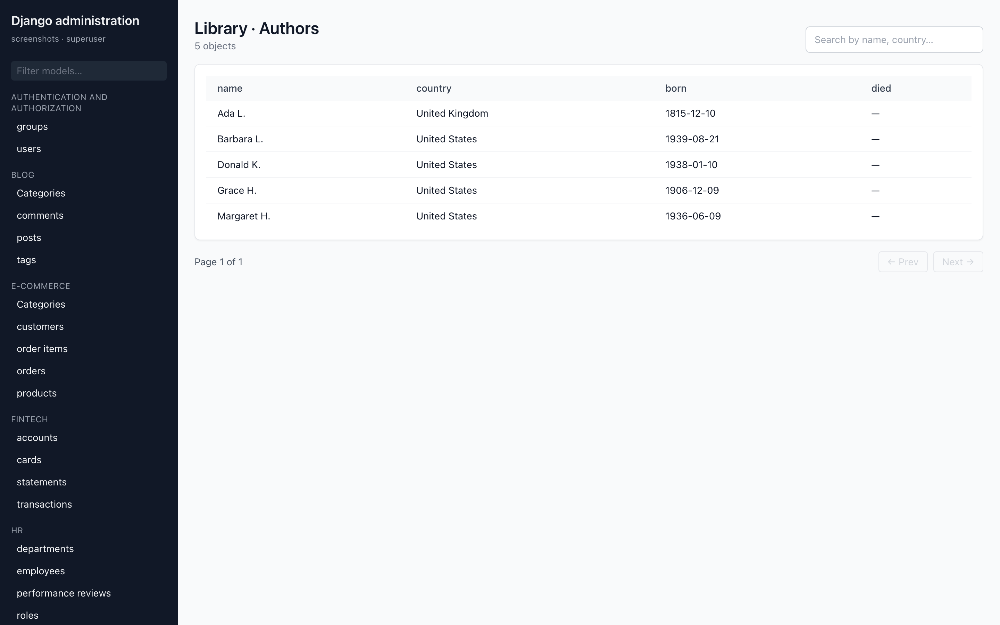
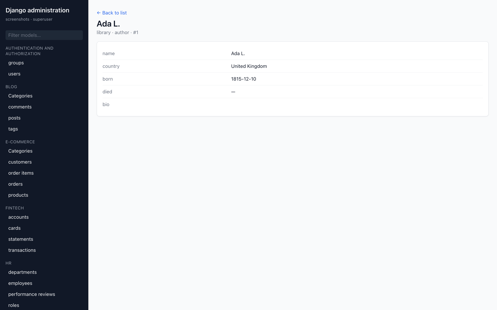

# django-admin-rest-api

> A JSON REST API for the Django admin — **same permissions, same `ModelAdmin`, no new features.**

[](https://pypi.org/project/django-admin-rest-api/)
[](https://pypi.org/project/django-admin-rest-api/)
[](https://www.djangoproject.com/)
[](LICENSE)
[](CHANGELOG.md)
[](https://djangopackages.org/packages/p/django-admin-rest-api/)

`django-admin-rest-api` exposes every `ModelAdmin` you've already
registered on `django.contrib.admin.site` (or your own `AdminSite`)
through a JSON REST API — **without** introducing a parallel
permission system, a parallel form layer, or any features the Django
admin itself doesn't have.

It is the wire surface that lets these projects drive your admin:

| Project | Role | PyPI |
| --- | --- | --- |
| 🟦 [`django-admin-react`](https://github.com/MartinCastroAlvarez/django-admin-react) | React single-page admin frontend | [`django-admin-react`](https://pypi.org/project/django-admin-react/) |
| 🟩 **`django-admin-rest-api`** *(this repo)* | JSON REST API over `ModelAdmin` | [`django-admin-rest-api`](https://pypi.org/project/django-admin-rest-api/) |
| 🟪 [`django-admin-mcp`](https://github.com/MartinCastroAlvarez/django-admin-mcp) | MCP server exposing the same API to LLMs | *(coming soon)* |

---

## ✨ The one design principle

**This package adds no new behavior. It is a JSON wrapper.**

That means every one of these is owned by your existing Django setup —
not by this library:

- 🔐 **Authentication** — Django's session + login. The API enforces the
  same `is_active` + `is_staff` + `AdminSite.has_permission` gate the
  HTML admin uses. No tokens, no custom auth backends, no JWTs.
- 🛡️ **Authorization / permissions** — every endpoint calls the
  matching `ModelAdmin.has_view_permission` / `has_add_permission` /
  `has_change_permission` / `has_delete_permission`. If your admin
  says no, the API says 403.
- 📋 **Field validation** — `POST` / `PATCH` route the payload through
  the same `ModelForm` Django would render in the HTML admin
  (`ModelAdmin.get_form(request, obj)`), so every clean method, every
  `unique_together` constraint, every custom widget validator runs
  exactly once and exactly the same way.
- ⚙️ **Actions** — the action registry comes from
  `ModelAdmin.get_actions(request)`. Your custom action functions run
  unmodified. **One declaration, two surfaces:** the signature of each
  action's third parameter chooses where it shows up in the SPA — a
  `queryset` (or `QuerySet`-annotated) param surfaces it on the
  changelist; an `obj_id` / `pk` / `id` param (or a `str`/`int`/`Model`
  annotation) surfaces it on the single-object detail page. No
  third-party dependency, no separate declaration list. See
  [⚙️ Configuration](#%EF%B8%8F-configuration) below.
- 🔎 **Search & filters** — search uses
  `ModelAdmin.get_search_results(request, queryset, term)`; filters
  use `ModelAdmin.list_filter`. No parallel implementation.
- 📜 **Audit log** — writes go through Django's `LogEntry` so your
  history page (and every other consumer of `LogEntry`) keeps working.
- 🌐 **CSRF & sessions** — Django's middleware. Nothing is
  `@csrf_exempt`.

If a behavior isn't in the HTML admin, it isn't here. If it is in the
HTML admin, this library exposes it over JSON.

---

## 🚀 Plug-and-play install

```bash
pip install django-admin-rest-api
```

Two changes to your project:

```python
# settings.py
INSTALLED_APPS = [
    # ... your existing apps ...
    "django.contrib.admin",
    "django_admin_rest_api",          # ← add
]
```

```python
# urls.py
from django.contrib import admin
from django.urls import include, path

urlpatterns = [
    path("admin/", admin.site.urls),
    path("admin-api/", include("django_admin_rest_api.urls")),  # ← add
]
```

That's it. Your admin is now also a JSON API at `/admin-api/api/v1/...`.

---

## 📡 The endpoints

| Method  | Path                                           | What it returns                                          |
| ------- | ---------------------------------------------- | -------------------------------------------------------- |
| `GET`   | `/api/v1/registry/`                            | The same app/model tree Django renders in the admin index |
| `GET`   | `/api/v1/schema/`                              | OpenAPI 3.1 schema of every endpoint below                |
| `GET`   | `/api/v1/<app>/<model>/`                       | List + pagination + filters + search                      |
| `POST`  | `/api/v1/<app>/<model>/`                       | Create (runs the same `ModelForm`)                        |
| `GET`   | `/api/v1/<app>/<model>/<pk>/`                  | Detail (read view as the HTML admin renders it)           |
| `PATCH` | `/api/v1/<app>/<model>/<pk>/`                  | Update                                                    |
| `DELETE`| `/api/v1/<app>/<model>/<pk>/`                  | Destroy (with `LogEntry`)                                 |
| `POST`  | `/api/v1/<app>/<model>/bulk-update/`           | Bulk patch                                                |
| `POST`  | `/api/v1/<app>/<model>/delete-preview/`        | Cascade preview (like the HTML admin's confirm page)      |
| `GET`   | `/api/v1/<app>/<model>/autocomplete/?q=…`      | `ModelAdmin.autocomplete_fields` source                   |
| `POST`  | `/api/v1/<app>/<model>/actions/<name>/`        | Run a `ModelAdmin` action; one endpoint serves both shapes (batch / detail) — the runner inspects the callable's signature and either passes the user-narrowed `QuerySet` or `str(pk)` for the single selected row |
| `GET`   | `/api/v1/<app>/<model>/<pk>/history/`          | The `LogEntry` history for one object                     |
| `GET`   | `/api/v1/recent-actions/`                      | The dashboard's "Recent Actions" feed                     |
| `POST`  | `/api/v1/login/`                               | Same `authenticate` + `login` as the HTML admin           |
| `POST`  | `/api/v1/logout/`                              | Same `logout`                                             |
| `POST`  | `/api/v1/<app>/<model>/<pk>/password/`         | JSON mirror of `UserAdmin`'s password-change page (`AdminPasswordChangeForm` + `AUTH_PASSWORD_VALIDATORS` + `set_password`); 404 unless the model's admin declares `change_password_form`; gated by `has_change_permission` |

Every endpoint enforces the same permission gates as the HTML admin.

---

## 📸 Screenshots

The JSON `registry` endpoint — the source-of-truth for any consumer
frontend:



And here is the same admin rendered by
[`django-admin-react`](https://github.com/MartinCastroAlvarez/django-admin-react)
on top of this API, to give you an idea of what a consumer can build:

| | |
|:-:|:-:|
|  |  |
|  |  |

---

## ⚙️ Configuration

All settings live under a single optional dict — defaults are sane,
so most projects need no entry at all.

```python
# settings.py (all keys optional)
DJANGO_ADMIN_REST_API = {
    # Dotted path to the AdminSite whose ModelAdmin registry the API
    # mirrors. Default exposes django.contrib.admin.site.
    "ADMIN_SITE": "django.contrib.admin.site",

    # Pagination. List endpoints use ModelAdmin.list_per_page as the
    # source of truth; DEFAULT_PAGE_SIZE is the fallback. MAX_PAGE_SIZE
    # caps ?page_size from the client (DoS guard).
    "DEFAULT_PAGE_SIZE": 25,
    "MAX_PAGE_SIZE": 200,

    # When True, list responses include per-query timing in a debug
    # block. Off by default — only enable in development.
    "ENABLE_PROFILING": False,
}
```

---

## ⚡ Actions: one declaration, two surfaces

Declare your actions exactly the way Django docs tell you to —
`@admin.action(description="…")` plus `actions = [...]` on your
`ModelAdmin`. The API surfaces each one in the registry, list, and
detail responses with a `target` field the SPA reads to decide
which surface to render it on:

```python
from django.contrib import admin
from django.db.models import QuerySet


@admin.register(MyModel)
class MyAdmin(admin.ModelAdmin):
    actions = ["reprocess_batch", "reprocess_one"]

    @admin.action(description="Reprocess selected")
    def reprocess_batch(self, request, queryset: QuerySet):
        # Shows up on the CHANGELIST (multi-select).  target=batch
        # The runner passes the user-narrowed queryset.
        ...

    @admin.action(description="Reprocess this one")
    def reprocess_one(self, request, obj_id: str):
        # Shows up on the DETAIL page only.            target=detail
        # The runner passes str(pk) for the row in view.
        ...
```

Both actions reach the same endpoint
(`POST /api/v1/<app>/<model>/actions/<name>/`). The runner inspects the
callable's third parameter — its **name** (`queryset` / `obj_id` / `pk`
/ `id` / …) and its **type annotation** (`QuerySet` / `str` / `int` /
`Model` subclass) — and dispatches to the right shape.

Permissions stay the same (`has_change_permission` per object). No
`django-object-actions`, no parallel declaration list, no new
configuration.

---

## 🔒 Security

- The API is **not** a parallel auth surface. It refuses any caller
  the HTML admin would refuse, with the same gate
  (`AdminSite.has_permission`, plus the per-model `ModelAdmin.has_*_permission`).
- Anonymous → `403` for every data endpoint.
- Authenticated but non-staff → `403`. Cookie present but resolved
  user is anonymous → `403 not_authenticated`.
- Writes always go through `ModelForm.is_valid()` —
  `unique_together`, `clean()`, field validators all run.
- Per-object guards run **before** the form does anything. The
  `delete-preview` and `delete` endpoints both check `has_delete_permission(obj)`.
- CSRF is enforced everywhere. No view in this package is
  `@csrf_exempt`. The login endpoint requires the CSRF cookie set
  by the consumer's shell.

See the upstream
[`django-admin-react` SECURITY.md](https://github.com/MartinCastroAlvarez/django-admin-react/blob/main/SECURITY.md)
for the full threat model — the API surface is identical and the
guarantees transfer 1:1.

---

## 🧪 Local development

```bash
git clone https://github.com/MartinCastroAlvarez/django-admin-api
cd django-admin-api
poetry install
poetry run pytest
poetry run ruff check .
poetry run black --check .
poetry run mypy django_admin_rest_api
poetry run bandit -c pyproject.toml -r django_admin_rest_api
```

The test suite uses `pytest-django` + an in-memory SQLite database, so
no setup beyond `poetry install`.

---

## 🤝 Contributing

Issues, PRs, and Discussions are welcome on GitHub:
<https://github.com/MartinCastroAlvarez/django-admin-api>.

The lint + security gate is the same set the upstream
`django-admin-react` repo uses: **ruff, black, isort, flake8,
pylint, mypy, bandit, pip-audit, gitleaks.** Every change must pass
all of them before merge.

---

## 📜 License

MIT. See [LICENSE](LICENSE).
